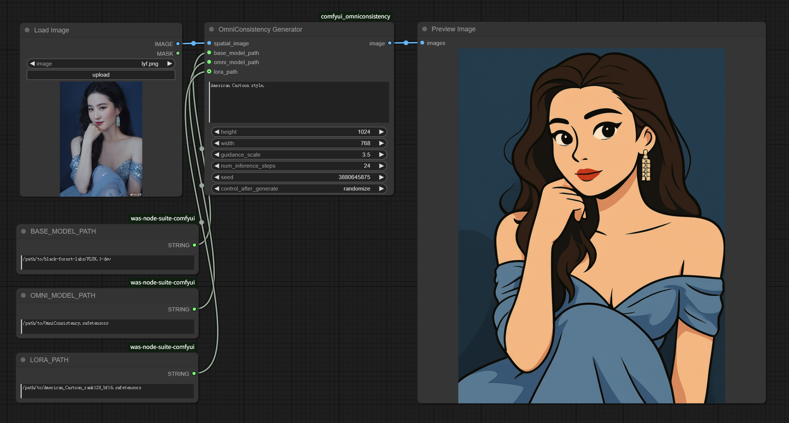
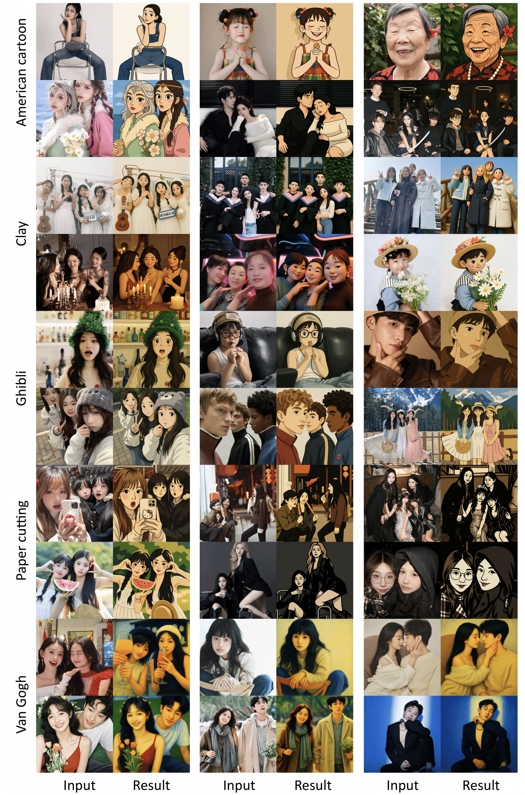

# ComfyUI OmniConsistency Nodes

ComfyUI OmniConsistency Nodes is a collection of nodes for ComfyUI that allows you to load and use OmniConsistency models.

https://github.com/showlab/OmniConsistency ComfyUI need 40GB VRAM to run.



## Installation
Clone the plugin repository into /path/to/ComfyUI/custom_nodes:
```
git clone https://github.com/lc03lc/Comfyui_OmniConsistency
cd Comfyui_OmniConsistency
pip install -r requirements.txt
```

## Model Download

**Required: OmniConsistency main checkpoint**  
→ https://huggingface.co/showlab/OmniConsistency/resolve/main/OmniConsistency.safetensors

Optional: OmniConsistency **built‑in LoRAs**  
→ https://huggingface.co/showlab/OmniConsistency/tree/main/LoRAs

**Note:** You can replace `lora_path` with **any FLUX‑1‑based LoRA**—whether it comes from Civitai, LiblibAI, or your own training—just point it to the corresponding `.safetensors` file.


## Node Inputs
| Port / Widget | Type | Default | Notes |
| --- | --- | --- | --- |
| **prompt** | STRING (multiline) | *\<Trigger Words\>, …* | Free‑text description |
| **spatial_image** | IMAGE port | — | One upstream image (HWC float32 0‑1, or any ComfyUI image type) |
| **height / width** | INT | 1024 | Must be multiples of 8 |
| **guidance_scale** | FLOAT | 3.5 | CFG scale |
| **num_inference_steps** | INT | 25 | DDIM / DPM steps |
| **seed** | INT | 42 | 0 = random |
| **base_model_path** | STRING | `black-forest-labs/FLUX.1-dev` | Local folder or HF repo name |
| **omni_model_path** | STRING | `/path/to/OmniConsistency.safetensors` | Main OmniConsistency weights |
| **lora_path** *(optional)* | STRING | *empty* | Any Flux.1-based extra LoRA; leave blank to disable |

## Node Output
`IMAGE` port → list \[torch.Tensor (H, W, C) float32 0‑1\]  
You can wire it directly to **Preview Image**, **Save Image**, **Upscale**, etc.

## Built-in LoRAs Results

