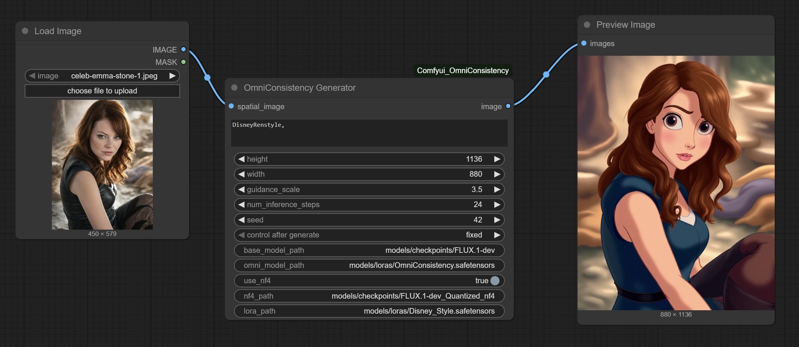

# ComfyUI OmniConsistency NF4

ComfyUI OmniConsistency NF4 is a collection of nodes for ComfyUI that allows you to load and use OmniConsistency models.

https://github.com/showlab/OmniConsistency ComfyUI need 24GB VRAM to run.



## Model Download
```
huggingface-cli download black-forest-labs/FLUX.1-dev --local-dir models/checkpoints/FLUX.1-dev --exclude "flux1-dev.safetensors"

huggingface-cli download priyesh17/FLUX.1-dev_Quantized_nf4 --local-dir models/checkpoints/FLUX.1-dev_Quantized_nf4

wget -O models/loras/OmniConsistency.safetensors "https://huggingface.co/showlab/OmniConsistency/resolve/main/OmniConsistency.safetensors?download=true"
wget -O models/loras/American_Cartoon_rank128_bf16.safetensors "https://huggingface.co/showlab/OmniConsistency/resolve/main/LoRAs/American_Cartoon_rank128_bf16.safetensors?download=true"
```
